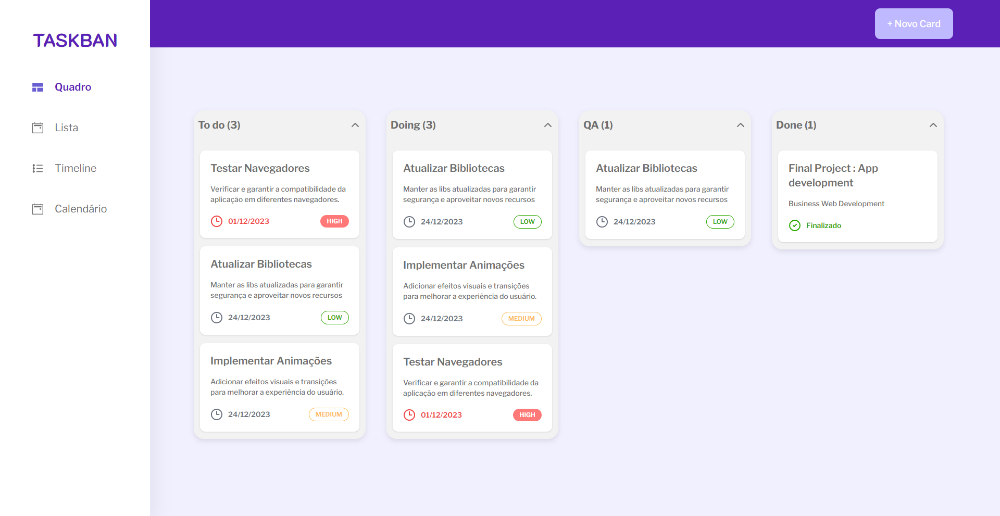

#  Taskban
### Este projeto foi desenvolvido para conclusão do desafio técnico chamado "Tech Challenge Hero Code". Este desafio foi projetado para preparar os participantes para entrevistas de emprego técnicas e para ajudá-los a aprimorar suas habilidades de programação.

Para visualizar o site acesse https://tech-challenge-hero.vercel.app/

## Projeto desenvolvido utilizando as seguintes tecnologias
  - React
  - Typescript
  - Next
  - Tailwind css

# Este projeto foi inicializado com [Next](https://nextjs.org/).

## Scripts Disponíveis

No diretório do projeto, você pode executar:

### `npm install`

Para instalação de todas as dependências necessárias para funcionamento do projeto.

### `npm run dev`

Executa o aplicativo:\
Abra [http://localhost:3000](http://localhost:3000) para visualizá-lo no navegador..

A página será recarregada se você fizer edições.
